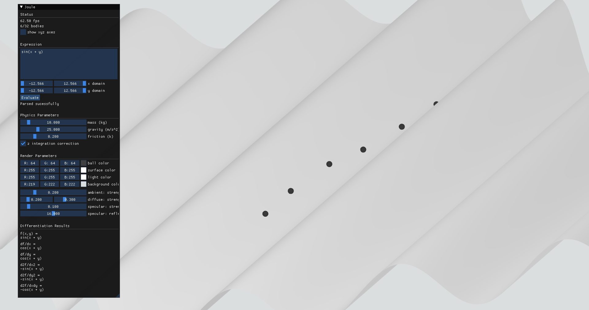

# Joule

>A Dynamic Surface, Potential Energy Rolling Motion Simulator

Final Project for **Programming in Science, section 00007**




## Author


Alex Xia<sup>1</sup>

<sup>1</sup>Dawson College, Montréal


## Controls

The interface is more intuitive with a mouse:

- Left-click: Add ball into simulation
- Right-click drag: Rotate view
- Right-click drag + Left control: Translate view
- Scrollwheel: Zoom in/out view

The *Expression* textbox takes any function f(x, y) that can be evaluated over the selected domain.

The *Evaluate* button will plot the function entered within the *Expression* textbox


## Installation

Clone source code
```bash
git clone https://github.com/ThatAquarel/joule.git
cd joule/
```

Install requirements and install Joule as a local package. Sometimes, the installation of `imgui[glfw]` on Windows throws an error: install Visual C++ Redistributable as per the error message and then directly run `pip install imgui[glfw]`. Also, developed on Python 3.11.
```bash
pip install -r requirements.txt
pip install -e .
```

Run application
```bash
python -m joule
```

## Codebase and Project Requirements

Here is specific guidance for navigating the code, and notable examples of every requirement:

- Student-made Functions: [Linear Algebra Helpers](./joule/compute/linalg.py) and [OpenGL Vertex Array Object Allocation](./joule/graphics/vbo.py)
- Import and use of at least one library: [Sympy for Calculus and Differentiation](./joule/compute/calculus.py)
- Loops: [Main Render Loop](./joule/app.py) and [Balls Rendering](./joule/graphics/elements/ball.py)
- Data structures: [Extensive Use of Numpy Arrays and Vectorized Operations in Physics](./joule/compute/mechanics.py)

File structure:

- `joule/`: *Joule* Python package root
    - `__main__.py`: Program main entrypoint called by `python -m joule`
    - `app.py`: Main application logic and class

- `joule/compute/`: Physics, Calculus and Linear Algebra computation module
    - `calculus.py`: Calculus and differentiation
    - `mechanics.py`: Physics, simulation and integration
    - `linalg.py`: Linear algebra helper functions

- `joule/graphics/`: Graphics and rendering
    - `orbit_controls.py`: Camera view mouse control
    - `parameter_interface.py`: User interface implementation and parameter state management
    - `shader_renderer.py`: Shader accelerated rendering engine
    - `shaders/`: GPU acceleration shaders
        - `vertex.glsl`: OpenGL Vertex Shader for coordinate transformation
        - `fragment.glsl`: OpenGL Fragment Shader for color
    - `vbo.py`: OpenGL Vertex Buffer Object helper functions
    - `elements/`: Rendered visual elements
        - `axes.py`: Axis gridlines
        - `ball.py`: Balls
        - `surface.py`: Surface
